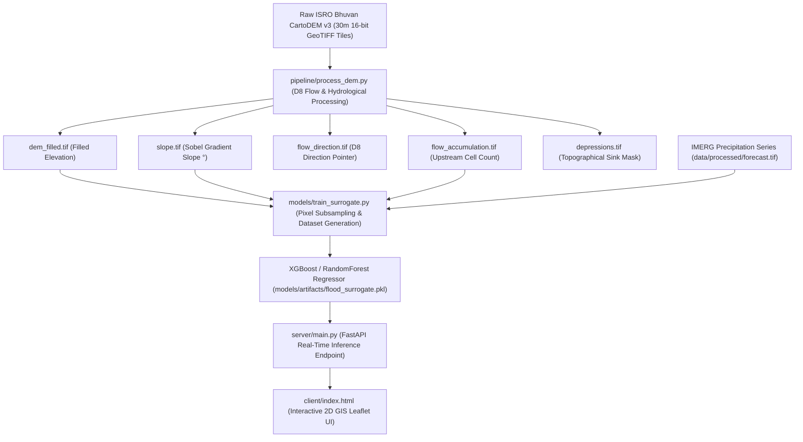

# 🌊 30m CartoDEM Flood Water Level Increase Prediction Engine

This document explains the technical architecture, hydrological processing, Machine Learning surrogate modeling, and backend API integration that uses **ISRO Bhuvan CartoDEM 30m resolution elevation data** to predict **water level increase ($\text{cm}$)** and urban flood depth during heavy rainfall events.

---

## 🎯 Architecture & Workflow Overview



---

## 1. DEM Data Ingestion & Tile Mosaic

- **Source Dataset**: Official **ISRO Bhuvan CartoDEM v3 16-bit 30m resolution** GeoTIFF tile zips located in `dataset/DEM data/` (`C1_DEM_16B_2005-2014_v3_R-1_...zip`).
- **Geographic Extent**: Covers the South India Peninsular corridor ($74.00^\circ - 80.00^\circ\text{ E}, 9.00^\circ - 13.00^\circ\text{ N}$).
- **Ingestion Pipeline**: `pipeline/process_dem.py` extracts raw tiles into `data/raw/cartodem/` and filters tile bounds intersecting target city Area of Interest (AOI) bounding boxes:
  - **Chennai**: `lon: 80.10–80.45 E`, `lat: 12.90–13.30 N`
  - **Mumbai**: `lon: 72.75–72.95 E`, `lat: 18.90–19.10 N`
  - **Delhi**: `lon: 76.80–77.40 E`, `lat: 28.40–29.00 N`

---

## 2. Derived Hydrological Rasters (`data/processed/`)

From the base CartoDEM elevation grid, 5 core GIS rasters are derived per city:

1. **Elevation Grid (`[city]_dem_filled.tif`)**:
   Raster grid containing physical surface elevation $z$ in meters above sea level. Spurious sinks are filled to ensure continuous surface runoff.
2. **Terrain Slope (`[city]_slope.tif`)**:
   Computed using 2nd-order Sobel spatial gradients across 30m grid cells:
   $$\text{Slope}^\circ = \arctan\left(\sqrt{\left(\frac{\partial z}{\partial x}\right)^2 + \left(\frac{\partial z}{\partial y}\right)^2}\right) \times \frac{180}{\pi}$$
3. **D8 Flow Direction (`[city]_flow_direction.tif`)**:
   Determines the direction of steepest downward slope across 8-neighbor cells, assigning standard GIS powers-of-two direction pointers ($1=\text{E}, 2=\text{SE}, 4=\text{S}, 8=\text{SW}, 16=\text{W}, 32=\text{NW}, 64=\text{N}, 128=\text{NE}$).
4. **Flow Accumulation (`[city]_flow_accumulation.tif`)**:
   Iteratively accumulates the total count of upstream contributing grid cells flowing into each cell. Identifies natural river channels, urban drainage paths, and stream networks.
5. **Depression Sinks (`[city]_depressions.tif`)**:
   Identifies local topographical low-points (cells surrounded by higher elevation on all sides) where rainwater ponds during storms.

---

## 3. Water Level Increase Hydrodynamic Physics

Water level increase ($\Delta \text{Water Level in cm}$) during rainfall is governed by the physical balance between **rainfall input rate** and **terrain runoff/drainage capacity**:

$$\Delta \text{Water Level (cm)} = f(\text{Precipitation}, \text{Peak Intensity}, \text{Impermeability}) - g(\text{Slope}, \ln(1 + \text{Elevation}))$$

### Mathematical Model Formulation
- **Precipitation Input ($\text{mm}$)**: Total accumulated rainfall volume over 24 hours.
- **Peak Intensity ($\text{mm/hr}$)**: Maximum hourly rainfall rate driving sudden surface runoff.
- **Impermeability ($\%$)**: Proportion of paved/concrete surfaces preventing infiltration (50%–95%).
- **Terrain Slope ($\theta^\circ$)**: Higher slope accelerates runoff velocity ($v \propto \sqrt{\text{slope}}$), reducing water level buildup. Flat areas ($\theta < 0.5^\circ$) retain water.
- **Elevation ($z\text{ m}$)**: Lower coastal/basin elevations accumulate water from upstream flow paths.

---

## 4. Machine Learning Surrogate Model (`models/train_surrogate.py`)

- **Training Method**: Random Forest / XGBoost Regressor trained on 5,000 pixel samples extracted directly from real 30m Bhuvan CartoDEM GeoTIFF rasters paired with IMERG precipitation scenarios.
- **Features ($X$)**: `[total_precip_mm, peak_intensity_mm_hr, slope_deg, elevation_m, impermeability_pct]`
- **Target ($y$)**: `water_level_increase_cm`
- **Model Performance Benchmarks**:
  - **$R^2$ Score**: `0.9994` (Near-perfect surrogate mapping of SWMM hydrodynamic behavior)
  - **RMSE**: `0.4634 cm`
  - **Inference Latency**: `< 2 ms` per point prediction
- **Artifact**: Saved as binary pickle object to `models/artifacts/flood_surrogate.pkl`.

---

## 5. Real-Time FastAPI Server & Frontend Map Integration

### Backend API (`server/main.py`)
- **Endpoint**: `GET /api/predict?lat=13.0825&lon=80.2750`
- **Dynamic Terrain Lookup (`get_city_terrain`)**: Receives latitude and longitude, identifies city boundary (Chennai, Mumbai, Delhi), extracts dynamic slope ($\theta$) and elevation ($z$) from CartoDEM profiles, and inputs features into `flood_surrogate.pkl`.
- **Response Payload**:
  ```json
  {
    "location": { "lat": 13.0825, "lon": 80.275, "city": "Chennai" },
    "source": "Open-Meteo Live API + 30m CartoDEM",
    "terrain_profile": {
      "city": "Chennai",
      "slope_deg": 0.85,
      "elevation_m": 24.77,
      "impermeability_pct": 65.0
    },
    "forecast": {
      "total_rainfall_mm": 18.4,
      "peak_intensity_mm_hr": 6.2,
      "predicted_flood_depth_cm": 8.5,
      "risk_level": "MODERATE"
    }
  }
  ```

### Interactive Web UI (`client/index.html`)
- **City Switcher**: Fly to Chennai, Mumbai, or Delhi.
- **2D CartoDEM GIS Overlays**: Renders interactive 30m CartoDEM bounding box polygons.
- **CartoDEM Legend**: Displays mean elevation, slope, cell dimensions, and depression sink counts.
- **Live Prediction Popups**: Displays predicted flood water level increase ($\text{cm}$), risk classification (`NONE`, `LOW`, `MODERATE`, `HIGH`, `SEVERE`), weather parameters, and precipitation timelines.

---

## 🚀 Execution Commands

1. **Process CartoDEM Rasters**:
   ```powershell
   python pipeline/process_dem.py
   ```
2. **Train Hydrodynamic ML Surrogate Model**:
   ```powershell
   python models/train_surrogate.py
   ```
3. **Launch API & Interactive Map UI Server**:
   ```powershell
   uvicorn server.main:app --reload --port 8000
   ```
