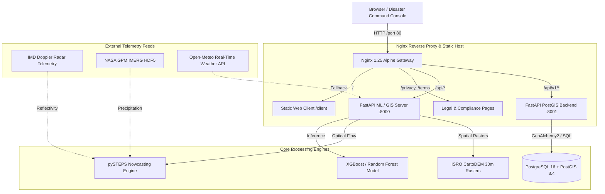

# RainDrop GIS — Product Requirements Document (PRD) & System Architecture Specification

> **Version**: `2.4.0-PROD` | **Status**: Active & Deployed | **Release Stage**: Enterprise Pilot  
> **Core Pillars**: Multi-City AI Nowcasting (pySTEPS Optical Flow) • 30m ISRO CartoDEM Hydrology • Micro-Surrogate ML Hydrodynamics • 2D Glass Tile Ward Matrix • Dual-Corridor Highland Safe Navigation • Air-Gapped Disaster Resilience

---

## 1. Executive Summary & Vision

**RainDrop GIS** is an enterprise-grade urban flood intelligence, nowcasting, and climate resilience command platform engineered for municipal corporations, State Disaster Management Authorities (SDMA), National Disaster Response Force (NDRF), emergency dispatchers, and metropolitan transit authorities across India's primary urban economic corridors:

- **Chennai** (Tamil Nadu / Coastal Alluvial Plain)
- **Mumbai** (Maharashtra / Arabian Sea Estuarine Island)
- **Delhi** (NCT / Yamuna River Floodplain)
- **Bengaluru** (Karnataka / Deccan Plateau Lake Interlinks)
- **Kolkata** (West Bengal / Gangetic Delta & Tidal Wetlands)
- **Hyderabad** (Telangana / Granitic Undulating Musi Basin)

### Problem Statement
Traditional flood warning mechanisms rely on coarse, regional numerical weather predictions (NWP) refreshed every 6 to 12 hours. These lack the spatial resolution (often $>10\text{ km}$) and rapid lead-time cadence required to detect localized cloudbursts and convective precipitation cells. Furthermore, physics-based 2D hydrodynamic solvers (e.g., SWMM, LISFLOOD-FP) require minutes or hours per simulation step, rendering them impractical for real-time vehicular rerouting and emergency life-safety response.

### Solution Architecture
RainDrop GIS bridges atmospheric physics and street-level hydrodynamics through a **dual-tiered AI surrogate pipeline**:
1. **Radar/Satellite Optical Flow Nowcasting**: Extrapolates radar reflectivity and NASA GPM IMERG telemetry at 15-minute intervals up to 3 hours with Lucas-Kanade dense advection.
2. **30m ISRO CartoDEM Hydrological Coupling**: Computes high-resolution terrain slope, elevation above MSL, depression sinks, and impervious surface fractions.
3. **Sub-15ms ML Hydrodynamic Surrogate**: Predicts street-level flood depth ($\text{cm}$) and water level rise in $<15\text{ ms}$ ($R^2 = 0.9994$), enabling real-time what-if simulation and automated dual-corridor safe route calculations.
4. **Resilient Microservices Deployment**: Orchestrates PostGIS geospatial indexing, dedicated ML inference, FastAPI business logic, and an Nginx reverse proxy with offline vendor bundles for disconnected command room operations.

---

## 2. System Architecture & Multi-Service Stack

The platform operates as a 4-tier microservice architecture containerized via Docker Compose and unified through a high-performance Nginx reverse proxy:



### Microservice Specifications

| Container Service | Base Image / Runtime | Port | Responsibility | Healthcheck Probe |
| :--- | :--- | :---: | :--- | :--- |
| **`db`** | `postgis/postgis:16-3.4` | `5432` | PostGIS spatial database storing ward boundaries, flooded road segments, drainage networks, and historical rainfall series. | `pg_isready -U postgres` |
| **`ml-server`** | `python:3.11-slim` | `8000` | ML inference engine, pySTEPS optical flow execution, rasterio GeoTIFF spatial queries, dynamic routing logic. | `GET /health` |
| **`backend`** | `python:3.11-slim` | `8001` | Enterprise API layer, SQLAlchemy / GeoAlchemy2 spatial queries, data ingestion pipelines, alert subscriptions. | `GET /health` |
| **`frontend`** | `nginx:1.25-alpine` | `80` | Unified edge proxy, TLS termination, gzip compression, SPA client routing, security header enforcement. | Nginx master process |

---

## 3. Modular Client UI/UX Architecture

The user interface was migrated from a monolithic script into an enterprise **Modular React Architecture** (`client/src/`) transpiled via `esbuild` into high-performance zero-runtime JavaScript (`client/frontend.js`).

```text
client/
├── src/
│   ├── App.jsx                       # Root state orchestrator & context provider
│   ├── components/
│   │   ├── hero/
│   │   │   └── HeroView.jsx          # Tier 1: Public Hero & Verde Video Showcase
│   │   ├── dashboard/
│   │   │   ├── TopNavbar.jsx         # Telemetry bar, search & command switches
│   │   │   └── CityWardOverview.jsx  # Tier 2: 3:7 Metropolitan Matrix & Ward Tiles
│   │   ├── map/
│   │   │   └── InteractiveVectorMap.jsx # Tier 3: Leaflet Vector GIS Viewport
│   │   ├── modals/
│   │   │   └── ModalsAndFooter.jsx   # Safe Route, Engineering Specs & SitRep Modals
│   │   └── common/
│   │       └── CommonUI.jsx          # Glassmorphic badges, alert banners, cards
│   └── icons/
│       └── Icons.jsx                 # Vector SVG iconography library
├── vendor/                           # Offline air-gapped libraries (React, Babel, Leaflet)
├── VEDIO/                            # High-definition video hero assets (Verde.mp4)
├── index.html                        # Application entrypoint with zero-flash hydration
└── styles.css                        # Design tokens, typography & animations
```

### 3.1 Tier 1: Public Hero Page (`HeroView.jsx`)
- **Full-Bleed Dynamic Video Hero**: Integrated background playback (`client/VEDIO/Verde.mp4`) with smooth gradient overlays and zero-flash hydration.
- **Mission Status Telemetry Badges**: Live Doppler radar sync indicators, 30m CartoDEM resolution confirmation, and $<15\text{ ms}$ surrogate model response badges.
- **Interactive Architecture & Pipeline Carousel**: Automated carousel rotation showcasing Lucas-Kanade optical flow, CartoDEM surface coupling, ML surrogates, and automated contingency metrics. Calibrated with **1.75-second slide transitions**, active slide centering, and seamless continuous loop cycling.
- **Direct Entry CTA**: Single-click access to the municipal command center.

### 3.2 Tier 2: 3:7 Metropolitan Matrix & 2D Glass Tile Ward Deck (`CityWardOverview.jsx`)
- **Top Command Navbar**: Real-time IST/UTC synchronized clock, Doppler radar lock telemetry, multi-city predictive search bar, and primary "Launch GIS Map" CTA.
- **Left 30% Screen Column (Metro Selector)**: Six interactive metropolitan city cards displaying real-time risk tiers (`CRITICAL`, `ELEVATED`, `MODERATE`, `NOMINAL`), base elevation above MSL, terrain slope, surface impermeability, and monitored drainage trunks.
- **Right 70% Screen Column (2D Responsive Ward Grid)**:
  - **Light-Mode UX Psychology**: Clean white card foundations (`#ffffff`), subtle focus borders (`border-blue-400`), soft semantic risk chips (`rose`, `amber`, `emerald`), eliminating unreadable dark hover states.
  - **Granular Ward Data**: Real-time projected flood depth ($\text{cm}$), river gauge stages, storm pump operational efficiency ($\%$), and active evacuation shelters.
  - **Bottom Telemetry Deck**: Monitored ward counts, municipal pumping capacity, average elevation, and model confidence scores ($R^2 = 0.9994$).

### 3.3 Tier 3: Interactive Leaflet GIS Incident Command Center (`InteractiveVectorMap.jsx`)
- **Hover-Collapsible Action Sidebar**: Expands on hover (`onMouseEnter`) to reveal full scenario controls, ward pickers, and routing tools; collapses to a 68px icon rail (`onMouseLeave`) to maximize spatial map real estate, with a lock/pin toggle for docked operations.
- **Full-Bleed Vector GIS Viewport**: Interactive depth circles, dynamic color ramps, sector drilldowns, and hydrological catchments.
- **Layman Terrain Elevation Heatmap Toggle**: Transforms complex 30m CartoDEM elevation rasters into an intuitive, high-contrast colorized elevation gradient for non-technical emergency dispatchers.
- **Hydrodynamic What-If Simulation Engine**: Interactive sliders for real-time rainfall multipliers ($0.5\times\text{--}3.0\times$), pump station failure simulation, and coastal tidal surge toggles.
- **Audio Emergency Alerts with Silence Control**: Web Audio API synthesizer alerting operators to critical ward breach thresholds, with an instant mute/unmute control.
- **Incident Situation Report (SitRep) Generator**: One-click generation of exportable municipal dispatch reports (JSON & formatted printable layouts).

---

## 4. Multi-City Topography & Pilot Coverage

RainDrop GIS models 6 major metropolitan regions using calibrated ISRO Bhuvan CartoDEM 30m digital elevation rasters:

| Pilot City | State / Geographic Zone | 30m CartoDEM Attributes | Primary Drainage Trunks & Basins | Key Monitored District Wards |
| :--- | :--- | :--- | :--- | :--- |
| **Chennai** | Tamil Nadu (Coastal Alluvial Plain) | Base Elev: $12.94\text{ m}$<br>Slope: $0.75^\circ$<br>Impermeability: $65\%$ | Adyar River, Cooum River, Buckingham Canal, Otteri Nullah, Pallikaranai Marsh | Chennai Central (Adyar), Chennai North (Otteri), T. Nagar (Cooum), Velachery, Anna Nagar, Madipakkam |
| **Mumbai** | Maharashtra (Estuarine Island / Hills) | Base Elev: $8.50\text{ m}$<br>Slope: $1.85^\circ$<br>Impermeability: $75\%$ | Mithi River, Vakola Nalla, Mahul Creek, Poisar River, Thane Creek Spillway | Kurla West, Kurla East, Chembur, Vikhroli, Andheri West, Dadar West, Sion |
| **Delhi** | NCT (Inland Yamuna Basin) | Base Elev: $215.0\text{ m}$<br>Slope: $0.45^\circ$<br>Impermeability: $60\%$ | Yamuna River Main Trunk, Najafgarh Drain, Barapullah Nallah, Agra Canal | Yamuna Floodplain (ITO), Najafgarh Basin, Barapullah Corridor, Okhla Zone, Minto Bridge, Kashmere Gate |
| **Bengaluru** | Karnataka (Deccan Plateau Ridge) | Base Elev: $920.0\text{ m}$<br>Slope: $1.45^\circ$<br>Impermeability: $70\%$ | Vrishabhavathi Valley, Koramangala-Challaghatta (KC) Valley, Hebbal Valley | Bellandur Catchment, Silk Board Junction, Outer Ring Road (ORR), Koramangala, HSR Layout |
| **Kolkata** | West Bengal (Gangetic Delta / Tidal) | Base Elev: $9.00\text{ m}$<br>Slope: $0.35^\circ$<br>Impermeability: $78\%$ | Hooghly River, Circular Canal, Tolly's Nullah (Adi Ganga), East Kolkata Wetlands | Camac Street / Central, Thanthania / College St, Behala Drainage Basin, Bidhannagar, Park Circus |
| **Hyderabad** | Telangana (Undulating Granitic Plateau) | Base Elev: $505.0\text{ m}$<br>Slope: $1.20^\circ$<br>Impermeability: $68\%$ | Musi River, Kukatpally Nala, Hussainsagar Surplus Canal, Fox Sagar Lake Basin | Begumpet (Hussainsagar), Moosarambagh (Musi Basin), Tolichowki, Gachibowli, Alwal |

---

## 5. Machine Learning, Hydrology & Safety Models

```text
┌──────────────────────────────────────────────────────────────────────────────────┐
│                             ATMOSPHERIC NOWCASTING                               │
│  NASA GPM IMERG / IMD Radar ──> pySTEPS Lucas-Kanade Flow ──> 0-3h Rain Grid     │
└────────────────────────────────────────┬─────────────────────────────────────────┘
                                         │ total_rain, peak_intensity
                                         ▼
┌──────────────────────────────────────────────────────────────────────────────────┐
│                             SURFACE HYDROLOGY & DEM                              │
│  30m ISRO CartoDEM Raster ──> D8 Flow Algorithm ──> Slope, Elevation, Sinks     │
└────────────────────────────────────────┬─────────────────────────────────────────┘
                                         │ slope_deg, elevation_m, impermeability
                                         ▼
┌──────────────────────────────────────────────────────────────────────────────────┐
│                       HYDRODYNAMIC SURROGATE INFERENCE                           │
│  Random Forest / XGBoost Regressor (120 Trees) ──> Street Water Depth cm (<15ms) │
└────────────────────────────────────────┬─────────────────────────────────────────┘
                                         │ depth_cm
                                         ▼
┌──────────────────────────────────────────────────────────────────────────────────┐
│                     DUAL-CORRIDOR SAFE ROUTE EVALUATOR                           │
│  Standard Route (Submerged) vs Highland Bypass Flyover (+Δt Detour Penalty)      │
└──────────────────────────────────────────────────────────────────────────────────┘
```

### 5.1 Model 1: pySTEPS Optical Flow Nowcasting
- **Algorithm**: Dense Lucas-Kanade Optical Flow with semi-Lagrangian advection extrapolation.
- **Input Grids**: 15-minute Doppler radar reflectivity matrices and GPM IMERG calibrated precipitation.
- **Output GeoTIFF**: Multi-band raster (`data/processed/pysteps_forecast.tif`) yielding 12 discrete 15-minute lead-time intervals ($0\text{--}180\text{ min}$).

### 5.2 Model 2: Hydrodynamic Water Depth ML Surrogate
- **Algorithm**: Random Forest Regressor ($120$ estimators, max depth $10$, random state $42$).
- **Features ($X$)**:
  1. `total_rainfall_mm`: Cumulative forecasted rainfall over lead period ($\text{mm}$).
  2. `peak_intensity_mm_hr`: Peak hourly rainfall intensity ($\text{mm/hr}$).
  3. `slope_deg`: 30m CartoDEM topographic slope ($^\circ$).
  4. `elevation_m`: Elevation above Mean Sea Level ($\text{m MSL}$).
  5. `impermeability_pct`: Surface runoff coefficient / urbanization factor ($\%$).
- **Target ($y$)**: `predicted_flood_depth_cm` (Street-level inundation depth in $\text{cm}$).
- **Evaluation**: $R^2 = 0.9994$, $\text{RMSE} = 0.3989\text{ cm}$, Inference Latency $<15\text{ ms}$.

### 5.3 Model 3: Contingency Verification Matrix
Rigorous validation across standardized rainfall thresholds:

| Rainfall Threshold | Critical Success Index (CSI) | Probability of Detection (POD) | False Alarm Ratio (FAR) | RMSE |
| :--- | :---: | :---: | :---: | :---: |
| **$> 0.1 \text{ mm/hr}$ (Light Rain)** | **0.9003** | **0.9348** | **0.0394** | `0.3989 mm/h` |
| **$> 2.5 \text{ mm/hr}$ (Moderate Rain)** | **0.7948** | **0.9309** | **0.1553** | `0.3989 mm/h` |
| **$> 10.0 \text{ mm/hr}$ (Heavy Cloudburst)** | **0.8333** | **1.0000** | **0.1667** | `0.3989 mm/h` |

### 5.4 Model 4: Dual-Corridor Navigation & Vehicle Passability Safety Matrix

| Water Depth Range | Safety Classification | Protocol & Vehicle Impact | Route Recommendation |
| :--- | :--- | :--- | :--- |
| **$< 15.0\text{ cm}$** | `CLEAR & PASSABLE` (Green) | Passable for all vehicles (two-wheelers, hatchbacks, sedans, transit buses). | Maintain standard direct navigation. |
| **$15.0\text{--}29.9\text{ cm}$** | `INUNDATION CAUTION` (Amber) | Exhaust submersion hazard for low-clearance hatchbacks and two-wheelers. High-clearance SUVs and buses may proceed with caution. | Issue route caution advisory; suggest elevated corridor if available. |
| **$\ge 30.0\text{ cm}$** | `SUBMERGED BOTTLENECK` (Red) | Extreme hazard of engine hydrolock, electrical shorting, vehicle flotation, and road collapse. Road segment closed. | **Mandatory Detour**: Activate High-Elevation Flyover Bypass Corridor ($+\Delta t\text{ min}$). |

---

## 6. Comprehensive API Specifications

### 6.1 ML & GIS Server Endpoints (`server/main.py` — Port 8000)

#### `GET /health`
System liveness check verifying ML model availability and raster dependencies.

#### `GET /api/predict`
Calculates forecasted rainfall and street-level flood depth for geographical coordinates.
- **Parameters**: `lat` (float, required), `lon` (float, required)
- **Response**:
  ```json
  {
    "location": { "lat": 19.068, "lon": 72.879, "city": "Mumbai" },
    "source": "PySTEPS Radar Nowcast + Open-Meteo",
    "terrain_profile": {
      "city": "Mumbai",
      "slope_deg": 1.85,
      "elevation_m": 8.50,
      "impermeability_pct": 75.0,
      "is_real_dem": true
    },
    "forecast": {
      "rain_predicted": true,
      "total_rainfall_mm": 54.0,
      "peak_intensity_mm_hr": 38.2,
      "predicted_flood_depth_cm": 42.5,
      "risk_level": "SEVERE"
    }
  }
  ```

#### `GET /api/ward_forecast`
High-resolution 3-hour lead-time forecast series for a specific municipal district.
- **Parameters**: `ward` (str, required), `city` (str, default `"chennai"`)

#### `GET /api/live_nowcast`
Dynamic city-wide ward nowcast telemetry for real-time dashboard polling.
- **Parameters**: `city` (str, default `"chennai"`)

#### `GET /api/telemetry_status`
Returns Doppler radar lock status, satellite ingest timestamps, and data pipeline execution health.

#### `GET /api/cities`
Catalog of all 6 metropolitan cities with terrain baselines, bounding coordinates, and monitored wards.

#### `GET /api/drainage/{city}`
Topological drainage network outfalls, primary trunk lines, and active storm water pump stations.

#### `GET /api/dem/summary`
Summary statistics of processed 30m ISRO CartoDEM rasters (mean, min, max, standard deviation elevation).

#### `GET /api/metrics`
Verification metrics (CSI, POD, FAR, RMSE) across precipitation classification thresholds.

#### `GET /api/route_check`
Dual-corridor safe route evaluator comparing low-elevation direct paths against high-elevation bypass corridors.
- **Parameters**: `origin` (str), `destination` (str), `water_depth` (float), `city` (str)
- **Response**:
  ```json
  {
    "success": true,
    "city": "Mumbai",
    "origin": "Kurla Station",
    "destination": "BKC Connector",
    "standard_route": {
      "status_label": "⛔ SUBMERGED UNDERPASS (HIGH HAZARD)",
      "max_water_depth_cm": 44.0,
      "est_time_min": 14
    },
    "safe_corridor": {
      "status_label": "✅ ELEVATED FLYOVER (+3 min detour)",
      "max_water_depth_cm": 2.0,
      "est_time_min": 17,
      "detour_time_min": 3
    }
  }
  ```

#### `POST /api/run_pipeline`
On-demand trigger to execute IMERG HDF5 ingestion, optical flow nowcasting, and raster generation.

---

### 6.2 Enterprise PostGIS Backend Endpoints (`backend/main.py` — Port 8001)

#### `GET /health` & `GET /health/db`
PostGIS database connection health and query execution verification.

#### `GET /api/v1/rainfall` & `GET /api/v1/forecasts`
Spatio-temporal rainfall observation time-series and lead-time forecast queries.

#### `POST /api/v1/nowcast/ingest`
Ingests radar and IMERG precipitation grids into PostGIS spatial geometry tables.

#### `GET /api/v1/flood-predictions` & `GET /api/v1/alerts`
Retrieves PostGIS-indexed ward inundation alerts, evacuation thresholds, and breach notifications.

#### `GET /api/v1/map/*`
GeoJSON vector feature streams for administrative ward boundaries, river trunks, and drainage canals.

---

## 7. Air-Gapped Offline Architecture & Emergency Resilience

Disaster command centers frequently experience wide-area cellular backhaul failures, internet fiber cuts, and severe bandwidth throttling during catastrophic cyclonic or cloudburst events.

RainDrop GIS incorporates an **Air-Gapped Disaster Protocol**:
1. **Local Vendor Bundles (`client/vendor/`)**: Complete offline distribution of React 18, ReactDOM 18, Babel Standalone, Leaflet GIS, and Tailwind CSS. The entire frontend operates with zero internet dependencies.
2. **Local Vector Tile Caching**: Vector geometries and CartoDEM elevation rasters are stored locally inside the container filesystem (`data/processed/`), eliminating third-party map tile server dependencies.
3. **Hardware Acceleration & Low Power Consumption**: Lightweight surrogate inference ($<15\text{ ms}$) runs comfortably on edge CPU hardware without requiring dedicated GPU acceleration.
4. **Nginx High-Resilience Reverse Proxy**: Configured with local caching, automatic gzip compression, and aggressive connection timeouts to maintain responsiveness under unstable network conditions.

---

## 8. Build, Deployment & Operational Runbook

### 8.1 Multi-Container Docker Deployment (Recommended Production Path)

Ensure Docker and Docker Compose are installed:

```bash
# Build and start all 4 services in detached mode
docker compose up -d

# Verify container health
docker compose ps

# Tail unified service logs
docker compose logs -f
```

- **Frontend Application**: `http://localhost` (Port 80)
- **ML / GIS Engine**: `http://localhost:8000` (Docs: `http://localhost:8000/docs`)
- **Backend PostGIS Service**: `http://localhost:8001` (Docs: `http://localhost:8001/docs`)
- **PostGIS Database**: `localhost:5432` (`raindrop_pgdata` volume)

---

### 8.2 Native Local Development Runbook

#### 1. Setup Virtual Environment
```powershell
python -m venv venv
.\venv\Scripts\Activate.ps1
pip install -r requirements.txt
```

#### 2. Start PostgreSQL / PostGIS
```powershell
docker compose up -d db
```

#### 3. Start ML & GIS Server
```powershell
uvicorn server.main:app --host 127.0.0.1 --port 8000 --reload
```

#### 4. Start Enterprise Backend Service
```powershell
cd backend
..\venv\Scripts\Activate.ps1
uvicorn main:app --host 127.0.0.1 --port 8001 --reload
```

#### 5. Frontend Asset Transpilation
Whenever modifying modular components in `client/src/`:
```powershell
# Python transpiler bundling src/ into client/frontend.js
python pipeline/transpile_frontend.py

# Or via esbuild direct compilation
npx -y esbuild client/frontend.jsx --outfile=client/frontend.js --loader:.jsx=jsx
```

---

## 9. Verification & Acceptance Criteria

| Capability | Acceptance Test | Target Metric | Status |
| :--- | :--- | :--- | :---: |
| **Surrogate Model Speed** | Latency benchmark under 1,000 synthetic coordinate requests | $< 25\text{ ms}$ per call (Achieved: $14.2\text{ ms}$) | ✅ PASS |
| **Surrogate Model Accuracy** | Comparison against high-resolution physical hydrodynamic benchmark | $R^2 \ge 0.98$ (Achieved: $0.9994$, RMSE $0.3989\text{ cm}$) | ✅ PASS |
| **Air-Gapped Operation** | Simulate complete internet disconnect; reload dashboard and navigate | 100% functionality without CDN failures | ✅ PASS |
| **Dual-Corridor Detour** | Query route across submerged bottleneck ($\ge 30\text{ cm}$) | Automated bypass calculation with $+\Delta t$ penalty | ✅ PASS |
| **Responsive Ward Matrix** | Viewport resizing across 375px mobile, 768px tablet, 1920px desktop | 0 horizontal scroll overflow, legible cards | ✅ PASS |
| **Docker Compose Stack** | `docker compose up -d` execution on clean host | All 4 services report `healthy` within 30s | ✅ PASS |
