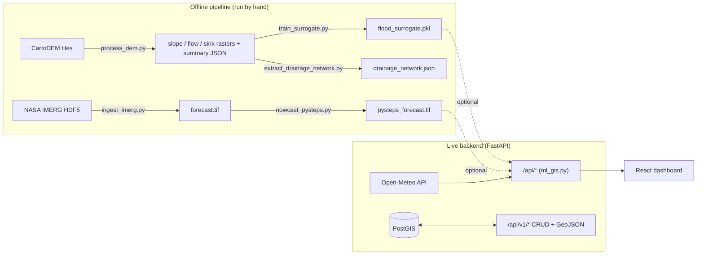

# RainDrop Codebase Walkthrough

RainDrop predicts street-level flood depth for Indian city wards. It joins a rainfall forecast with terrain data and estimates water depth in centimetres. A React dashboard shows the result on a map.

This walkthrough explains how the code works today. It also lists the gaps between the code and the claims in the README.

Companion files in `docs/walkthrough/`:

| File | What it is | How to open |
|---|---|---|
| `architecture.excalidraw` | Editable system diagram | Drag into https://excalidraw.com |
| `flood-risk-explainer.html` | Interactive page: rainfall → depth → risk | Double-click to open in a browser |
| Section 9 below | Explainer-video scene script | Read, or render later |

---

## 1. The system in one picture



Read it left to right. The offline pipeline makes files. The live backend reads some of those files, if they exist. Dotted arrows are optional inputs: the backend still runs without them.

The dashboard only calls the `/api/*` routes. No frontend code calls the `/api/v1/*` PostGIS routes yet.

---

## 2. Folder map

| Folder | Purpose | Key files |
|---|---|---|
| `backend/` | FastAPI server | `main.py`, `app/api/*.py`, `app/services/*.py` |
| `pipeline/` | Offline data scripts | `ingest_imerg.py`, `nowcast_pysteps.py`, `process_dem.py` |
| `models/` | Surrogate model training | `train_surrogate.py` |
| `client/` | Static React app (no bundler) | `src/**`, `frontend.jsx`, `frontend.js`, `index.html` |
| `data/raw/imerg/` | Four IMERG half-hour files (21 June 2025) | `*.HDF5` |
| `data/processed/` | Pipeline output | **Empty in this checkout** |
| `scratch/` | Vendored pySTEPS source and archived scripts | Not used at runtime |
| Root | Deployment | `Dockerfile`, `docker-compose.yml`, `nginx.conf`, `.github/workflows/deploy.yml` |

---

## 3. Trace one request: "How deep will Velachery flood?"

The dashboard's main data call is `GET /api/ward_forecast?ward_name=Velachery&city=Chennai`. It repeats every 30 seconds (`client/src/App.jsx`, `loadWardForecast`).

1. **Find the ward.** `resolve_ward_info()` searches `METRO_REGISTRY` in `ml_gis.py`. It uses partial name matching. If nothing matches, it returns Velachery.
2. **Get terrain.** `get_city_terrain()` returns one city-wide profile from `CITY_TERRAINS`: mean slope, mean elevation, and impermeability. Every ward in a city gets the same terrain values.
3. **Get rainfall.** `fetch_open_meteo_weather()` calls Open-Meteo. The code takes the first 12 hourly precipitation values.
4. **Sum it up.** `total_rain` is the sum of the 12 values. `peak_intensity` is the largest value.
5. **Predict depth.** If `models/artifacts/flood_surrogate.pkl` exists, the Random Forest predicts depth from five features: `[total_rain, peak, slope, elevation, impermeability]`. Otherwise the code uses a fixed formula:

   ```
   depth_cm = max(0, 0.4 × total_rain + 0.2 × peak − 1.0)
   ```

   This checkout has no model file, so **the formula runs**.
6. **Estimate river stage and pumps.** Both are formulas on `total_rain` and `depth`. There is no sensor input.
7. **Classify risk.** The first rule that matches wins:

   | Status | Rule |
   |---|---|
   | CRITICAL EMERGENCY | depth > 25 cm, or peak > 25, or total > 50, or river stage ≥ danger level |
   | HIGH RISK WATCH | depth > 12, or peak > 10, or total > 20 |
   | MODERATE RISK | depth > 3, or peak > 2.5, or total > 5 |
   | LOW WATCH | total > 0.1 |
   | NORMAL MONITORING | otherwise |

8. **Build a timeline.** Four steps (+15 to +60 min). Each value is a fixed fraction of the depth from step 5.

`flood-risk-explainer.html` lets you change the inputs and watch each step.

---

## 4. Backend modules

`backend/main.py` creates the app, serves `client/` at `/static`, and mounts nine routers. On start-up it tries to connect to PostGIS. If that fails, it prints a note and keeps running. The `/api/*` routes still work; the `/api/v1/*` routes fail.

### 4.1 `/api/*` — ML and GIS routes (`app/api/ml_gis.py`)

| Route | What it does | Data source |
|---|---|---|
| `GET /api/predict?lat&lon` | Rainfall series, depth, and risk for a point | pySTEPS raster if present, else Open-Meteo |
| `GET /api/ward_forecast` | Section 3 above | Open-Meteo + formula/model |
| `GET /api/live_nowcast` | Calls `ward_forecast` or `predict` | Same |
| `GET /api/cities` | City and ward registry | Hard-coded dictionary |
| `GET /api/dem/summary` | Terrain summary for a city | JSON file, else dictionary |
| `GET /api/drainage/{city}` | Drainage network GeoJSON | JSON file, else computed |
| `GET /api/metrics` | CSI, POD, FAR, RMSE | **Random synthetic arrays** |
| `GET /api/telemetry_status` | Sensor status | **Hard-coded values** |
| `GET/POST /api/run_pipeline` | "Runs" the pipeline | **Returns a fixed success message; runs nothing** |
| `GET /api/route_check` | Standard vs safe route | **Fixed geometry around the city centre** |

### 4.2 `/api/v1/*` — PostGIS routes

These routes store and return records. They need a database.

| Router file | Routes | Notes |
|---|---|---|
| `rainfall.py` | `/rainfall`, `/forecasts`, `/forecasts/sync` | `sync` calls `/api/predict` over HTTP and saves the series |
| `ingestion.py` | `/ingestion/radar-rainfall`, `/terrain`, `/roads`, `/drainage-nodes`, `/drainage-edges` | Plain inserts |
| `processing.py` | `/processing/terrain/{id}`, `/runoff`, `/flood-estimate` | Rational-method runoff minus drain capacity |
| `surrogate.py` | `/processing/surrogate-prediction` | Samples the DEM raster at the point, then runs the model |
| `nowcast.py` | `/nowcast/ingest` | Turns a forecast series into predictions and alerts |
| `flood.py` | `/flood-predictions`, `/alerts` | CRUD |
| `map.py` | `/map/flood`, `/rainfall`, `/forecasts`, `/roads`, `/drainage`, `/alerts`, `/routes/safe` | GeoJSON layers |

The runoff model in `terrain_processing.py`:

```
runoff coefficient C = 0.2 + 0.7 × impervious_fraction
runoff volume (m³)   = rainfall (m) × area (m²) × C
excess (m³)          = max(0, runoff − drain capacity × duration)
depth (cm)           = excess / area × 100
```

Risk here uses different thresholds from Section 3: critical ≥ 30 cm, high ≥ 15, moderate ≥ 5.

### 4.3 Database (`app/models/tables.py`)

Nine tables, all with SRID 4326 geometry: `rainfall`, `forecast`, `radar_rainfall_grids`, `terrain_datasets`, `roads`, `drainage_nodes`, `drainage_edges`, `flood_predictions`, `alerts`. `initialize_database()` creates them and runs `ALTER TABLE ... IF NOT EXISTS` for schema changes. There is no migration tool.

---

## 5. Offline pipeline

Run these from the project root, in order.

| Step | Script | Input → Output | How it works |
|---|---|---|---|
| 1 | `pipeline/ingest_imerg.py` | IMERG HDF5 → `forecast.tif`, `payload.json` | Crops each file to a bounding box and stacks the frames |
| 2 | `pipeline/nowcast_pysteps.py` | `forecast.tif` → `pysteps_forecast.tif` | Lucas-Kanade motion + semi-Lagrangian extrapolation. Without pySTEPS it decays the last frame by 0.85 per step |
| 3 | `pipeline/process_dem.py` | CartoDEM tiles → slope, D8 direction, flow accumulation, sinks, summary JSON | Uses real tiles from `data/raw/cartodem/` if present; otherwise builds a synthetic surface |
| 4 | `pipeline/extract_drainage_network.py` | Rasters → `{city}_drainage_network.json` | High flow-accumulation cells + OSM canals (Overpass) + a synthetic fallback |
| 5 | `models/train_surrogate.py` | DEM samples → `flood_surrogate.pkl` | See Section 6 |
| — | `pipeline/evaluate_nowcast.py` | Arrays → CSI/POD/FAR/RMSE/MAE | Correct contingency-table maths; not wired to real data yet |
| — | `pipeline/transpile_frontend.py` | `client/src/**` → `frontend.jsx` → `frontend.js` | Joins the modules in a fixed order and runs Babel through Node |

---

## 6. What the surrogate model learns

`train_surrogate.py` does **not** train on SWMM or observed floods. It makes a synthetic target with a formula:

```
depth = 0.42·precip + 0.35·peak + 0.028·impermeability − 0.95·slope − 0.18·ln(1+elevation) + noise
```

A Random Forest then learns that formula. It reports R² on the **training data**, with no held-out split. So the "R² = 0.9994" in `/api/telemetry_status` measures how well the forest copies the formula. It does not measure flood-prediction skill.

To make the model meaningful:

1. Get ground truth: observed waterlogging depths, crowd reports, or SWMM runs on a real network.
2. Hold out whole storm events (not random rows) for testing.
3. Compare against a baseline: the linear formula itself, and simple persistence.

---

## 7. Frontend

`client/` is a static React 18 app. React, ReactDOM, and Leaflet load from `client/vendor/`. There is no npm build. You edit `client/src/**`, then run the transpile step (Section 8).

`App.jsx` holds almost all state. It switches between three views with `view`:

| View | Component | Purpose |
|---|---|---|
| `hero` | `HeroView.jsx` | Landing page with city backdrops |
| `overview` | `CityWardOverview.jsx` | 3:7 layout: city list on the left, ward cards on the right |
| `command` | `InteractiveVectorMap.jsx` | Leaflet map, sector drawer, time slider, scenario sandbox, safe-routing panel |

Most ward details, sector depths, and route options come from `client/src/data/mockData.js`. Live values from `/api/ward_forecast` replace the hydrograph rain series. The "surge" series is derived as `1.2 + rain × 0.05`.

Recent UI changes (previous walkthrough):

- Light hover state on ward cards (white, blue border) instead of near-black.
- Risk chips: rose = high/critical, amber = moderate, emerald = low.
- Removed the "2D Hydrodynamic Ward Tiles" subheader and the "Hero Page" navbar button.
- Removed `backdrop-filter` blur and the unused DaisyUI stylesheet to cut render cost.

---

## 8. Run it

**Local, without Docker:**

```powershell
pip install -r requirements.txt
cd backend
uvicorn main:app --reload --port 8000
```

Open http://127.0.0.1:8000. Without PostGIS, the dashboard still works.

**Rebuild the frontend after editing `client/src/`:**

```powershell
python pipeline/transpile_frontend.py
```

Or, for a single-file edit of `frontend.jsx`:

```powershell
npx -y esbuild client/frontend.jsx --outfile=client/frontend.js --loader:.jsx=jsx
```

**Full stack:** `docker compose up --build`. This starts PostGIS (5432), the backend (8000), and Nginx (80). Nginx proxies `/api/` and `/health` to the backend.

---

## 9. Known issues found while reading the code

Ordered by impact on prediction correctness.

| # | Where | Problem | Fix |
|---|---|---|---|
| 1 | `ml_gis.py` `fetch_open_meteo_weather` | `forecast_days=1` returns hours from 00:00 UTC today. `[:12]` takes midnight–11:00, not the next 12 hours. | Add `&timezone=auto&forecast_hours=12`, or slice from the current hour |
| 2 | `ml_gis.py` lines ~414, 630, 647 | Paths use `Path(__file__).parent.parent / "data"` = `backend/app/data/`. DEM summaries and drainage JSON never load. | Use `ROOT_DIR / "data" / "processed"` |
| 3 | `pipeline/ingest_imerg.py` | IMERG latitude ascends (south first). After the transpose, row 0 is south, but `from_bounds` treats row 0 as north. The raster is flipped north–south. | `p = precip[lns, ls].T[::-1]` |
| 4 | Pipeline → backend | `nowcast_pysteps.py` writes to the `--output` folder (README: `data/processed/forecasts/`). The backend reads `data/processed/pysteps_forecast.tif`. | Use one path |
| 5 | `train_surrogate.py` | Synthetic target, training-set R² (Section 6) | Real labels, event-level holdout |
| 6 | `process_dem.py` | Synthetic DEM seed uses `hash(city_key)`. Python randomises string hashes per run, so output changes every run. "Flow accumulation" counts 4 neighbours; it is not a true upstream-area accumulation. "dem_filled" is not depression-filled. | Fixed seed (e.g. `zlib.crc32`); use `pysheds` or `richdem` for fill and accumulation |
| 7 | `/api/metrics`, `/telemetry_status`, `/run_pipeline`, `/route_check` | Return synthetic or fixed values that look live in the UI | Label them as demo in the UI, or connect real data |
| 8 | `ml_gis.py` fallback `evaluate_predictions` | Returns lower-case keys (`pod`); the real function returns upper-case (`POD`) | Match the keys |
| 9 | `.github/workflows/deploy.yml` | Health check curls port 8001 and an `ml-server` that `docker-compose.yml` does not define | Curl 8000; remove `ml-server` |
| 10 | Two risk scales | `ward_forecast` (3 / 12 / 25 cm) and `classify_flood_risk` (5 / 15 / 30 cm) disagree | Pick one scale and share it |

---

## 10. Explainer-video script

Status: script only. No ElevenLabs key is set and Manim is not installed. To render, add `ELEVENLABS_API_KEY` to `.env`, install Manim in a virtual environment, and follow https://raw.githubusercontent.com/ashryaagr/karpathy-output-style/main/skills/explainer-videos/references/workflow.md.

Question: *How does RainDrop turn a rain forecast into a flood warning?* Audience: SIH judges and new team members. Example: Velachery, Chennai.

| # | Visual change | Narration | Sec |
|---|---|---|---|
| 1 | Map of Chennai; Velachery ward pulses | "It is going to rain in Velachery. Will the streets flood? RainDrop tries to answer that for every ward." | 8 |
| 2 | Twelve rain bars rise one by one | "First, RainDrop asks Open-Meteo for twelve hours of rainfall. It adds them up, and it notes the heaviest hour." | 10 |
| 3 | Three terrain dials appear: slope, elevation, paved surface | "Next, it looks up the ground. Flat, low, paved land floods first. Steep, high, green land drains fast." | 10 |
| 4 | Bars and dials flow into a box labelled "depth" | "These five numbers go into a model. Today that model is a simple formula: more rain means more water, minus a small allowance." | 12 |
| 5 | Water level rises on a street figure; threshold lines at 3, 12, 25 cm | "The result is a depth in centimetres. Past three, the ward is at moderate risk. Past twelve, high. Past twenty-five, critical." | 12 |
| 6 | Dashboard card turns amber, then rose | "The dashboard colours each ward card by that risk, and refreshes every thirty seconds." | 8 |
| 7 | Box labelled "depth" opens to show "synthetic training data" | "One honest caveat: the model has not yet learned from real floods. Real depth records are the next step." | 10 |

Total: about 70 seconds.
